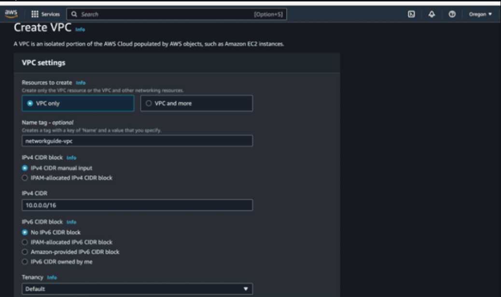
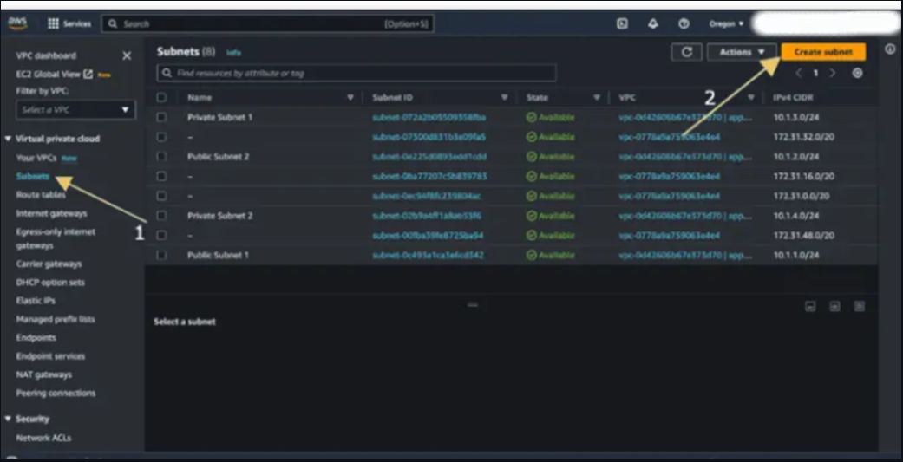
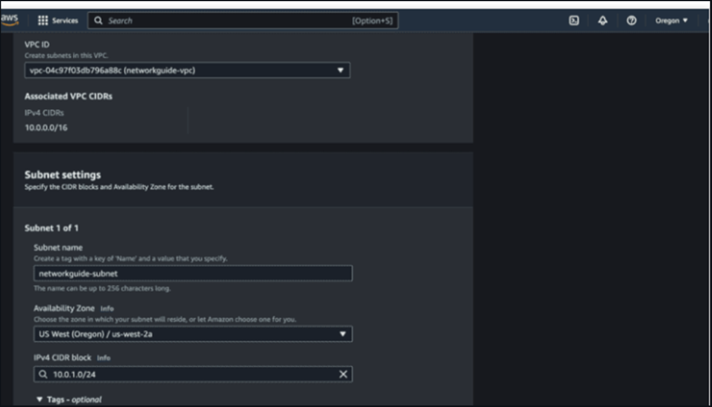
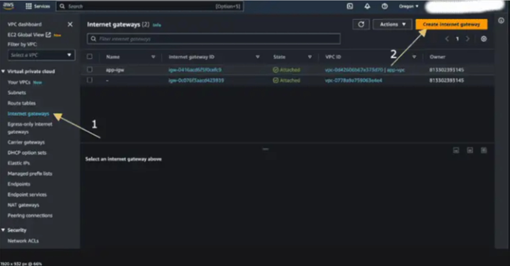
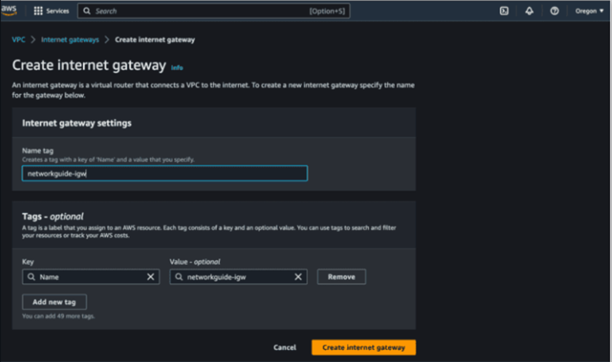
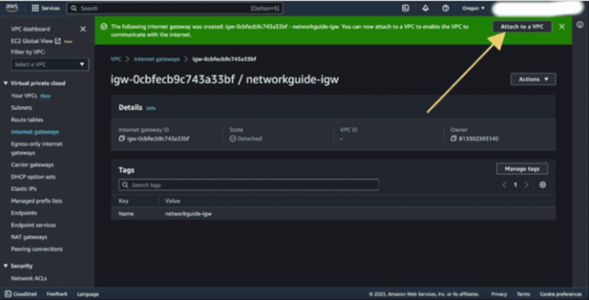
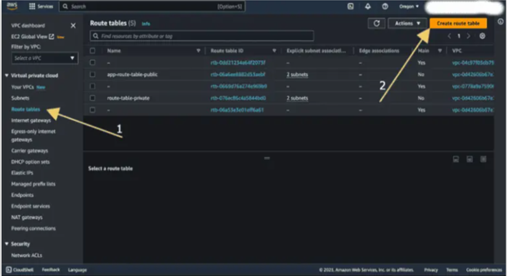
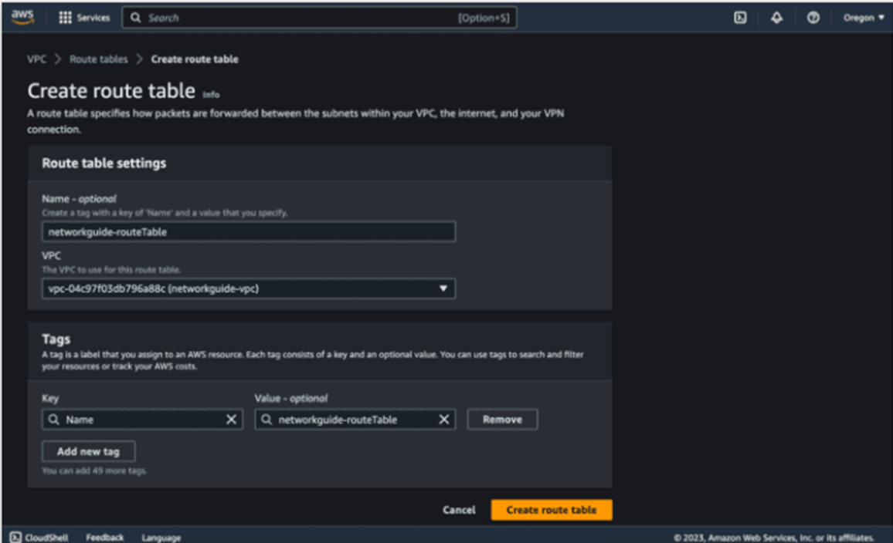
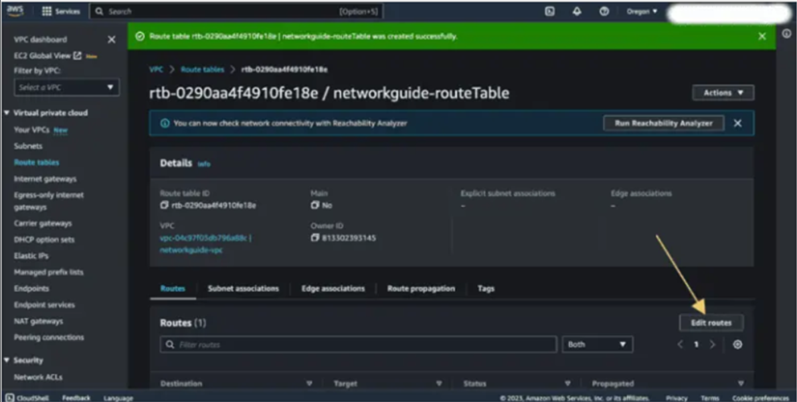
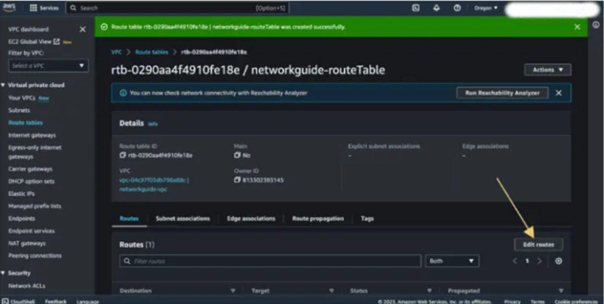

# Ex 4 Deployment and configuration of a Private Cloud in AWS
## NAME: HARINI R
## REG NO: 212223100010

## Aim:
To set up of a Private Cloud in AWS.

## Setting up of a private cloud in AWS:
Setting up a private cloud within AWS, also known as a Virtual Private Cloud (VPC), involves creating a logically isolated virtual network that you can use to launch AWS resources. This provides you with full control over your virtual networking environment, including resource placement, connectivity, and security. Amazon Virtual Private Cloud (Amazon VPC) gives you full control over your virtual networking environment, including resource placement, connectivity, and security. Get started by setting up your VPC in the AWS service console. Next, add resources to it such as Amazon Elastic Compute Cloud (EC2) and Amazon Relational Database Service (RDS) instances. Finally, define how your VPCs communicate with each other across accounts, Availability Zones, or AWS Regions.

## Procedure:

### Plan Your VPC:
● Determine your needs:

### Define your use case, including application requirements, security needs, and compliance standards.

● Plan IP address ranges:

### Choose appropriate IP address ranges for your VPC and subnets to avoid conflicts.

● Select Availability Zones:

### Decide which Availability Zones (AZs) you'll use for your resources, considering redundancy and performance.

● Plan internet connectivity:

### Determine if you need public internet access and how to configure it.

● Define security:

### Plan your security groups, network ACLs, and access controls to ensure a secure environment.

### Create Your VPC:
• Sign in to AWS Management Console: Access the VPC console and navigate to the VPC dashboard.

• Choose "Create VPC": Initiate the VPC creation process.

• Configure VPC details: Enter the VPC name, CIDR block, Availability Zones, and other necessary settings.

• Create subnets: Define subnets within your VPC to isolate different parts of your network.

• Create route tables: Specify how traffic is routed within and outside the VPC.

• Create security groups: Define access control rules for your resources.

### Deploying Resources:
• Launch EC2 instances: Create and launch virtual machines within your VPC.

• Set up RDS instances: Deploy databases for your applications.

• Configure networking: Connect your resources to the appropriate subnets, security groups, and route tables.

• Deploy other AWS services: Integrate other services like S3 for storage and Lambda for serverless computing.

### Managing and Monitoring:

• Use AWS CloudWatch: Monitor your VPC and resources for performance and health.

• Configure logging and auditing: Track access and activity within your VPC for security and compliance.

• Implement security best practices: Regularly review and update your security configuration.

• Scale and adjust as needed: Adjust your VPC infrastructure to meet changing demands.

## Output:

### Snapshot 1: Create VPC image

### Snapshot 2: Configuring Subnets

### Snapshot 3: Configure Subnets

### Snapshot 4: Setting Internet gateway

### Snapshot 5: Setting Internet gateway

### Snapshot 6: Setting Internet gateway

### Snapshot 7: Creating route table

### Snapshot 8: Configuring route table

### Snapshot 9: Editing routes

### Snapshot 10: Creating route table

## Result:
Thus, a private cloud on AWS involves using VPCs has been created for a dedicated, isolated network where we can manage our resources and control access according to our requirements.